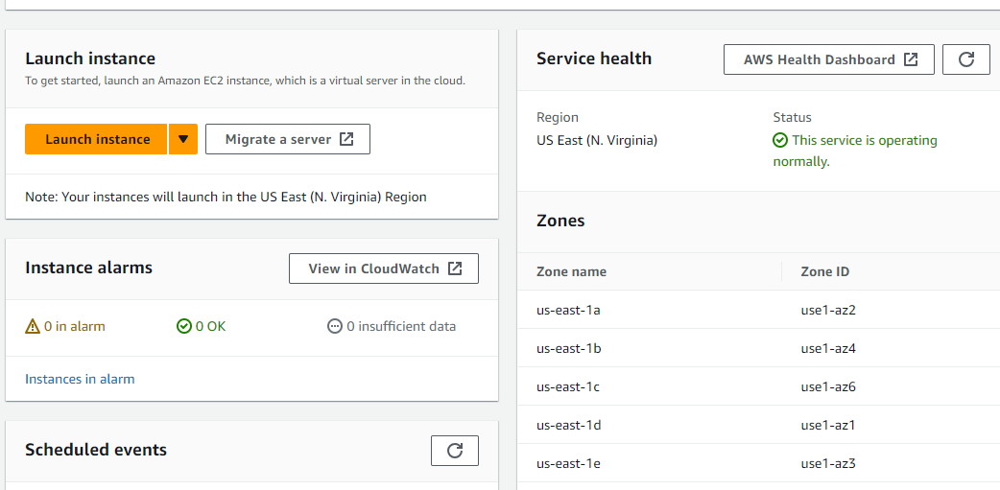
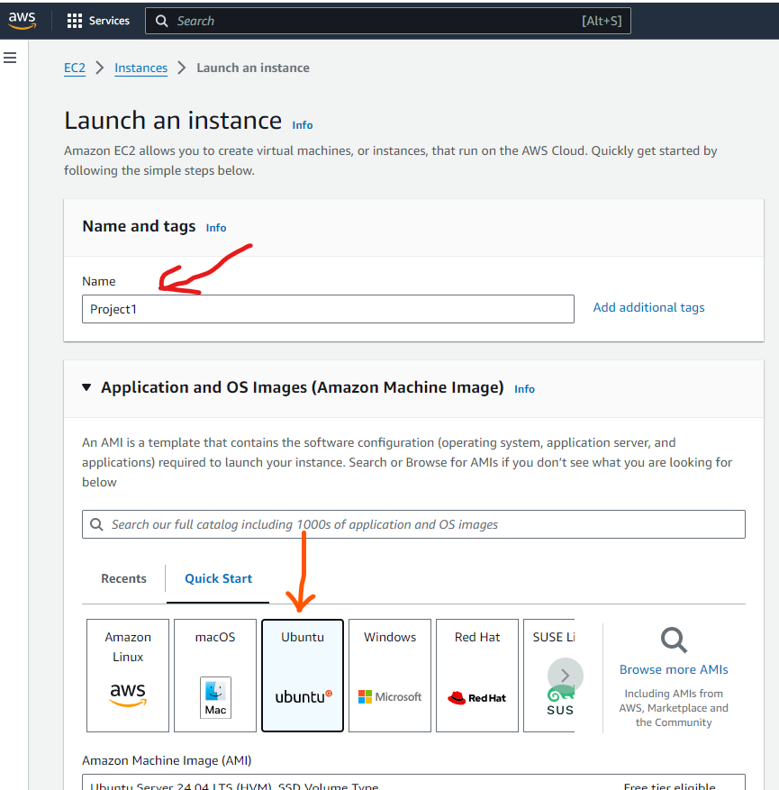
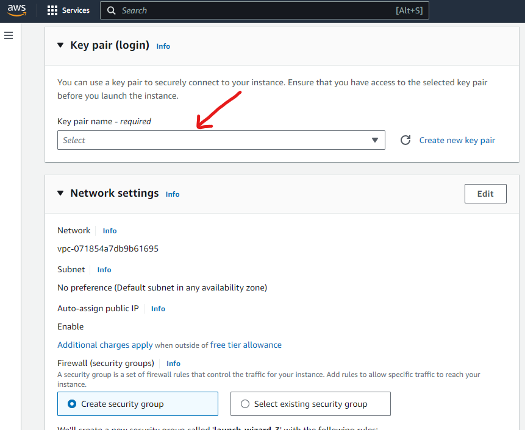
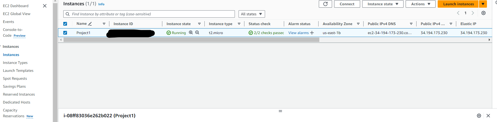
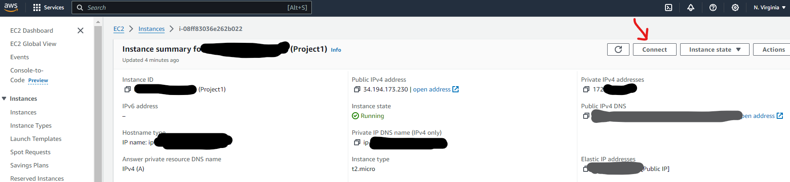
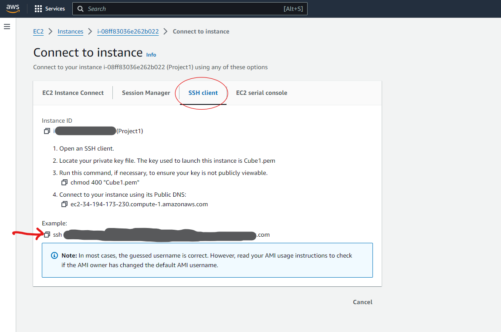

# Setting up a Static Website with Nginx

This is my first project with which I attempted to launch a static website using Nginx

1. Create an Ubuntu server by EC2 and clicking "Launch Instance" on my AWS MGT console

- I named the instance and selected Ubuntu 

- I then created a key pair name as shown below:

- I clicked on SSH, HTTP, and HTTPS access and clicked on launch instance

- I then clicked on the named instance created 

- Click on the connect button as shown below:

-I copied the prompt under SSH client

Final result of the website: I did not save all the screenshots of the processes I took to get here.

End of Project1

